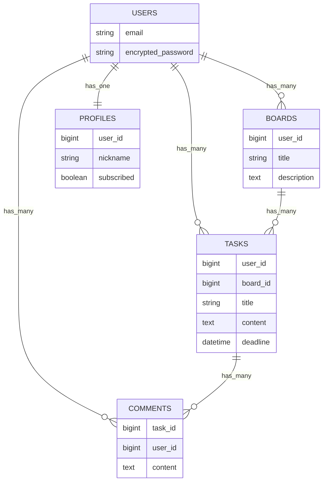

## aym-todo-app


### アプリ概要

#### 概要：

チームでのタスク管理を効率化するための TODO アプリです。
ボード（例：「マーケ」「人事」など）単位でタスクを整理し、それぞれのタスクにはコメントを追加できます。

#### 利用者想定：

社内でプロジェクトや業務に関するタスク管理を行いたいチームメンバー向け。

#### 開発背景：

このアプリはフロントエンドコース中級の最終課題として制作しました。
以下のような社内課題の解決を目的としています：

- 特定の課題について議論する専用の場所がない
- チャットツールでは議論がすぐに流れてしまい、情報が整理できない

> 💡 課題で提示された要件：
>
> - 課題ごとに議論できるアプリケーション
> - ボード単位で課題（タスク）を管理できる
> - ログイン後、ボード・タスクを作成可能
> - タスクにはタイトル・内容・期限が設定できる
> - タスクはユーザーに紐づき、作成ユーザーのみが編集・削除可能

### 主な機能

- ユーザー認証機能（ログイン・ログアウト）
- ボード（board）の CRUD
- タスク（task）の CRUD
- コメント機能（task に対して複数コメント可能）
- 画像アップロード機能（Active Storage 利用）
- ログインユーザーのみが投稿・編集・削除可能

#### ディレクトリ構成（抜粋）

```text
app/
├── controllers/         # 各種コントローラ
├── models/              # 各種モデル（Board, Task, Userなど）
├── views/               # HAMLによるビュー。partial化を徹底
│   ├── boards/
│   ├── comments/
│   ├── commons/         # 再利用可能な共通パーツ
│   └── layouts/
├── assets/
│   └── stylesheets/     # SCSSによるスタイル定義（mixin活用）
├── javascript/          # Stimulusコントローラなど
...

config/
├── routes.rb            # ルーティング定義
├── initializers/        # 各種初期設定（deviseなど）
├── locales/             # 多言語対応（日本語／英語）
...

db/
├── migrate/             # マイグレーションファイル群
├── schema.rb            # スキーマ定義
├── seeds.rb             # 初期データ投入ファイル
```

#### ER 図

<details><summary>表示</summary>



</details>

### 開発環境

| カテゴリ       | 使用技術                               |
| -------------- | -------------------------------------- |
| バックエンド   | Ruby 3.2 / Rails 8.0.2                 |
| フロントエンド | HAML / SCSS                            |
| データベース   | PostgreSQL                             |
| 主な Gem       | Devise（認証） / ActiveStorage（画像） |
| デプロイ       | Heroku / S3（画像アップロード）        |

#### ▼ URL

本アプリは Heroku にデプロイ済みです。

[🔗 aym-todo-app](https://aym-todo-app-be4a924a49e3.herokuapp.com/)

##### アプリの使い方
1. 上記のリンクをクリックしてアプリを開きます。
2. 画面右上の “Log in” ボタンをクリックします。
3. ログイン画面の最下部にある “Guest login” ボタンをクリックします。
4. ログイン後、各機能をお試しいただけます。

※ゲストログインのデータは共通の仮アカウントで利用されるため、操作内容は他のユーザーと共有されます。

### 工夫したところ

- 課題以外の設計や実装、スタイリング、UI/UX は独自に構成
- HAML ＋ SCSS でビューを構築し、可読性と保守性を考慮して partial 化
- モデルにロジックを集約し、view はできる限りシンプルに保つようリファクタリング済み

#### ▼ スタイリング（SCSS）

本アプリでは、再利用性と保守性を意識した SCSS 設計を行っています。具体的には以下のような工夫を取り入れました。

- `@mixin`による共通デザインの抽出
- `@use`で変数を一元管理
- SCSS ファイルの partial 化と役割ごとの整理

```scss
// 共通のカードデザインをmixinに
@mixin base-card($width: 360px, $height: 160px, $padding: 30px 20px) {
  width: $width;
  height: $height;
  border-radius: 10px;
  background-color: variables.$bg-content;
  padding: $padding;
  display: flex;
  flex-direction: column;
  justify-content: space-between;
  position: relative;
}
```

```scss
// base-card を継承して新規カード用に調整
@mixin new-card($height: 160px) {
  @include base-card(360px, $height, 0);
  font-size: variables.$font-lg;
  border: 1px dotted #00000033;
  background-color: variables.$base-bg-color;
  justify-content: center;
  align-items: center;
  padding: 0;
}
```

```scss
// 使用例
.board {
  @include base-card;
  margin-bottom: 30px;
  ...
}

.new_board(45px) {
  @include new-card;
}
```
